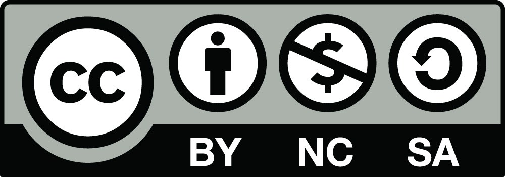

# **Parte 1 - Instalação dos programas básicos para uso do LaTeX** 

  &times; 
  <strong>Informe:</strong> começa sexta-feira, 27 de março, às 21h, com as primerias videoaulas liberadas!</a>

## Instalação do MiKTeX no Windows

Após baixar o programa, basta seguir as orientações que aparecem na tela. Teremos uma videoaula mostrando o processo de instalação. 

## Instalação do TeXstudio no Windows 
Após baixar o programa, basta também seguir as orientações que aparecem na tela. 

<!--
## **Licença**

 

 
Esta obra está sob licença <em>Creative Commons</em> CC BY-NC-SA 4.0: esta licença
permite que outros remixem, adaptem e criem a partir do seu trabalho para fins não
comerciais, desde que atribuam o devido crédito e que licenciem as novas criações
sob termos idênticos.

-->